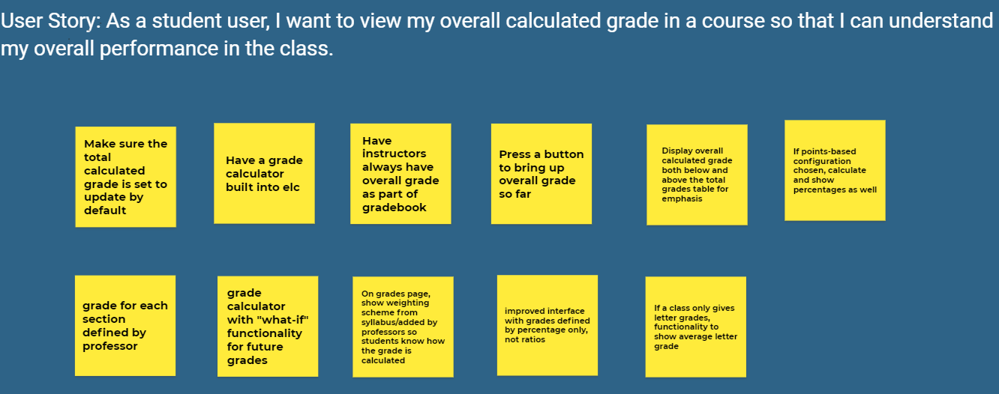
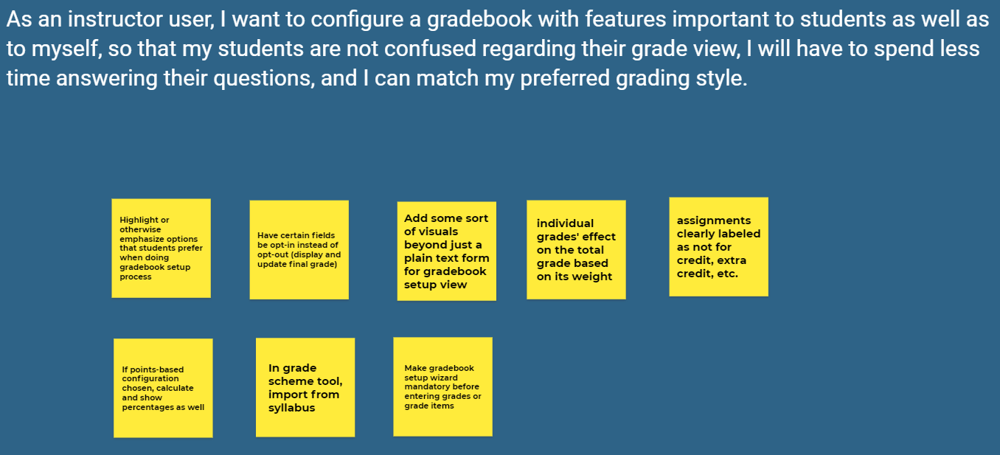
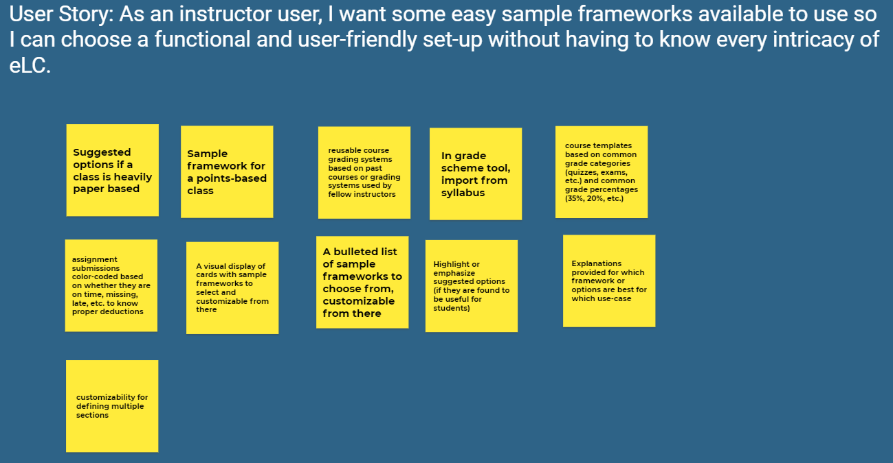
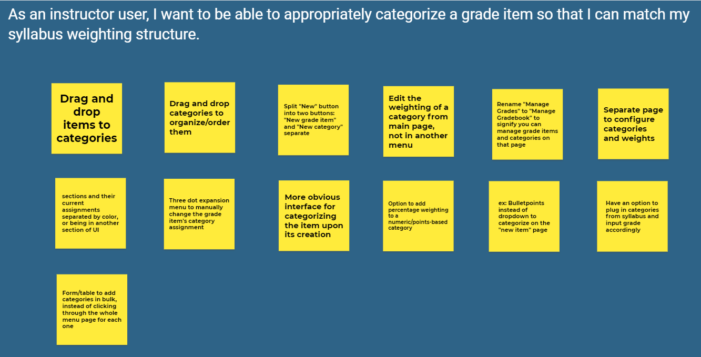
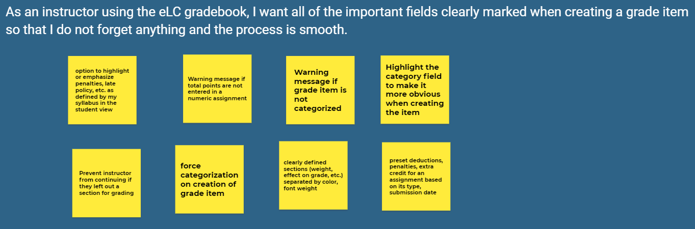

# Milestone 3: Design Alternatives
[Back to Home](https://matzomt.github.io/csci4800/)

## A. User Experience Requirements
### Activities
We have grouped our user stories by activities available. With each group, we italicized the stories chosen which we believe are most relevant, and provided a brief justification as to why the others were not chosen. Additionally, we provide a more detailed breakdown with justification and evidence provided for each chosen user story.

**Activity: viewing grades**
1. As a student user, I want to view my graded assignments for a class, so that I can know my performance on specific assignments.
2. As a student using the eLC gradebook, I want to be able to understand at a glance how much I got on an assignment and how much it is weighted in the category.
3. As a student using the eLC gradebook, I want to view the total points available on a numeric assignment as well as the points I earned, so that I can know what percentage I scored.
4. As a student using the eLC gradebook, I want to be able to understand my grades clearly so that I know which sections of the class I should focus more on.
5. As a student using the eLC gradebook, I want to be able to calculate my current grade so that I know the grades I need to earn in order to obtain a certain letter grade.
6. *As a student user, I want to view my overall calculated grade in a course so that I can understand my overall performance in the class.*

Justification: While all of these user requirements for students are important, user story 6 is generally encompassing many of the other stories. Additionally, upon analyzing in Milestone 2, we found that almost all of the features desired by students, as described in stories 2, 3, and 5, are already available in eLC, but the issue lies in inconsistent implementation on the instructor end. Thus, there are not many changes required on the student view of the eLC gradebook, as we believe that a redesign of the instructor-side UI will automatically resolve many of the student requirements.

**Activity: viewing gradebook**
1. As an instructor user, I want to view a specific student’s grade on a specific assignment so that I can double check if I entered it correctly.
2. As an instructor user, I want to view each student’s final grade in my course so that I can enter their final grades into Athena.
3. As an instructor, I want to be able to view differences in grades (e.g. late penalty, quiz time expired, never turned in) which can be more than just a simple number
4. As an instructor using the eLC gradebook, I want to be able to see which students have not submitted an assignment so that I can notify them to complete an assignment.

Justification: While instructors viewing the eLC gradebook is a related activity when considering the eLC grades system as a whole, it is not as relevant to the overall solution, which requires addressing how the gradebook structure looks on the student side. Thus, these user requirements are not relevant to our problem.

**Activity: gradebook setup**
1. As an instructor user, I want to configure my gradebook to match the structure of my course so that I can enter grades that accurately reflect the nature of my assignments and my preferred grading style.
2. As an instructor user, I want to be able to adjust my gradebook configuration so that I can adapt throughout the semester if needed.
3. *As an instructor user, I want some easy sample frameworks available to use so I can choose a functional and user-friendly set-up without having to know every intricacy of eLC.*
4. *As an instructor user, I want to configure a gradebook with features important to students as well as to myself, so that my students are not confused regarding their grade view, I will have to spend less time answering their questions, and I can match my preferred grading style.*

Justification: User stories 3 and 4 were the most central to our goal to make configuration of the eLC gradebook easier for instructors and and more uniform for students. We feel that the other stories they will be less relevant to address for this project, which involves creating a visual representations of the selected user stories, and are not directly related to the proposed solution outlined in Milestone 2. For instance, user story 1 is an important issue for instructors, but is less directly relevant to addressing the specific problem we identified which ultimately deals with how the gradebook looks on the student side. User stories 3 and 4 specifically address making the UI more intuitive for the instructor to configure the gradebook while matching student needs, and addressing these will include designs to make user story 1 easier as well. User story 4 is particularly important as it directly ties together the student and instructor desires.

**Activity: creating assignments and categories**
1. As an instructor using the eLC gradebook, I want to create an assignment from scratch so that I can enter grades for assignments I handed out in person and graded on paper.
2. As an instructor user, I want to create a grade item that was assigned on eLC so that I can take advantage of the eLC assignments/quizzes section, with less work for me.
3. As an instructor using the eLC gradebook, I want to be able to clearly note the total points available when creating a numeric assignment so that I can more easily calculate grade averages for students at the end of a course.
4. *As an instructor using the eLC gradebook, I want all of the important fields emphasized when creating a grade item so that I do not forget anything and the process is smooth.*
5. As an instructor user, I want to add categories to my gradebook so that I can match my syllabus weighting structure.
6. As an instructor using the eLC gradebook, I want to be able to appropriately categorize a grade item so that I can more easily determine a student’s final grade.
7. *As an instructor user, I want to be able to appropriately categorize a grade item so that I can better match my syllabus weighting structure.*

Justification: The first two user stories are not as immediately relevant to our problem, though they are related activities available on the eLC Grades page for instructors, so we did not highlight them as part of our potential solution. User story 3 captures an issue related to our problem, as described in our Proposed Solution section in Milestone 2, but it falls under user story 4, which is a more general version. As such, we chose user story 4. We also chose user story 7 as one of the more relevant stories, also described in our Milestone 2 proposed solution. User story 7 encompasses user story 5 and 6, as they are a common group.

**Activity: entering grades**
1. As an instructor user, I want to have a compatible interface to allow entering grades much easier and less intimidating, so that I can quickly get grades uploaded.
2. As an instructor using the eLC gradebook, I want to be able to view the status of my students’ assignment submissions so that I have a better understanding of which grades I have already inputted or need to be graded.

Justification: As a group, we felt the issues brought up in user stories in this section would be better addressed by stories regarding creating assignments and categories. This is because the actual activity of entering grades is not as immediately relevant to the problem we outlined in Milestone 2 - more issues can be traced back to the gradebook setup and structure rather than the grading process itself - and as such, would not be as valuable to consider for our solution.

### Top User Stories
**As a student user, I want to view my overall calculated grade in a course so that I can understand my overall performance in the class.**
- Justification: The main problem we identified in Milestones 1 and 2, and the potential solution described in Milestone 2, all center around the need for students to understand their overall class performance and the fact that eLC currently often fails to meet that requirement.
- Evidence: The University of Colorado Boulder published a Learning Management System Evaluation Report for their students - this school primarily uses the Brightspace Desire2Learn (D2L) Learning Environment platform, which is what eLC at UGA is based on. The survey indicated that students at UC Boulder had the most comments and complaints about the following pain points: ”Gradebooks not kept up to date,” “Gradebooks not set up to calculate final grade,” and “Gradebooks not set up to display current course grade” [1, pg. 8]. 

**As an instructor user, I want to configure a gradebook with features important to students as well as to myself, so that my students are not confused regarding their grade view, I will have to spend less time answering their questions, and I can match my preferred grading style.**
- Justification: Instructors are also an affected stakeholder to the gradebook issue because there are barriers within D2L that can prevent them from configuring a more intuitive gradebook. However, our proposed solution highlights the fact that if professors can configure the gradebook to match their course structure, it will make grade interpretation easier for students. Existing guides to configuring a D2L/eLC gradebook, namely the UGA guide and D2L’s guide, are very text-heavy and expose the flaws of eLC’s UI compared to other learning management systems. eLC also fails in several principles of good design, such as many hidden and nested functionality and a lack of good signifiers.
- Evidence: In Brightspace’s guide to configuring a D2L gradebook, there are no visuals provided to instructors [6]. This issue makes it more difficult for instructors who are not accustomed to D2L to learn how to configure the gradebook to meet their needs, especially considering that the eLC/D2L UI is lacking. The UI for configuring the eLC gradebook is not intuitive in comparison to other gradebook technologies such as Canvas and Blackboard; UGA’s eLC guide for faculty reveals that eLC’s grade setup process is also very text heavy without assistance via diagrams and colors [5].

**As an instructor user, I want some easy sample frameworks available to use so I can choose a functional and user-friendly set-up without having to know every intricacy of eLC.**
- Justification: A major part of our problem analysis was the inconsistency in student views of the Grades page, stemming from the vast options for customization available to professors. However, many options that students desire take some time to set up. Having some sample frameworks to choose from as starting points may make the Gradebook schema set up process easier for professors who are not as comfortable with technology and/or do not want to spend a lot of time setting up a gradebook. In contrast, the gradebook configuration pages for both Canvas and Blackboard possess a more user-friendly interface with better signifiers and discoverability in the form of distinct colors and icons that eLC lacks.
- Evidence: In the University of Colorado Boulder study focusing on faculty experiences with the Desire2Learn platform, many instructors noted the gradebook was both hard to use and lacking adequate features [2]. Many students at UC Boulder also noted frustration with the basic configurations used by instructors [1]. We believe that adding sample frameworks may ease this process for instructors and allow for options that better accommodate student desires as well. Canvas instructor view documentation [7], Blackboard Instructor features [8], reveal features that eLC lacks.

**As an instructor user, I want to be able to appropriately categorize a grade item so that I can match my syllabus weighting structure.**
- Justification: Categorization of gradebook items is relevant to our problem’s proposed solution because making it easier for professors to have appropriate and easier categorization of grade items would lead to more structured gradebooks across the board, making it easier for students to interpret the Grades page. Currently, categorization in D2L is lacking and is hidden behind many menus/clicks and means this user requirement is not adequately fulfilled.
- Evidence: When our group members analyzed online sentiment of D2L via Reddit comments, we saw comments from many instructors using the platform. For instance, one professor noted that “Setting up grades and assignments are very confusing” and another agreed, replying “Currently using D2L and trying to figure out why important features are buried in weird places” [4]. The categorization of grade items is one such example, where one must go through several clicks just to create a new category or change the category of an existing assignment. In Milestone 2, we found that alternate LMS platforms such as Canvas and Blackboard both had easier drag-and-drop interfaces to move grade items to categories, so we believe that D2L/eLC would benefit from having similar functionality as the industry leaders, and it would make the platform easier to use, addressing common complaints [7][8].

**As an instructor using the eLC gradebook, I want all of the important fields emphasized when creating a grade item so that I do not forget anything and the process is smooth.**
- Justification: The main problem of students having an inconsistent gradebook view stems from the vast availability of options available to instructors when creating and entering gradebook assignments. Often, though, this means the menu on the instructor side is cluttered up and instructors may forget certain important fields when creating the assignment. Adding some signifiers that these fields are often important to student users, such as highlighting and warning prompts, would help professors remember which fields are important to include.
- Evidence: One of Shneiderman et al.’s Eight Golden Rules for Interface Design is to *Reduce short term memory* [3]. This is often classed as an important design feature because it makes an interface easier and more convenient to use for the user, and involves making options and information available upfront [3]. In this case, adding important signifiers would mean that professors would have less to remember when creating a grade item, making the interface easier to use and ultimately making the gradebook page more useful for students. This also would contribute to making the overall interface of the D2L Grades system easier to use, which was a common complaint found in UC Boulder’s faculty survey of LMS [2].

## B. Ideation and Preliminary Designs
### Ideation
**User Story 1**: As a student user, I want to view my overall calculated grade in a course so that I can understand my overall performance in the class.

Ideation Screenshot:

Top Ideas:
- Have the overall calculated grade set up to be displayed and updated by default in its own section. 
- Employ a grade calculator built into the eLC grades page to calculate overall grade (both current and potential). 

**User Story 2**: As an instructor user, I want to configure a gradebook with features important to students as well as to myself, so that my students are not confused regarding their grade view, I will have to spend less time answering their questions, and I can match my preferred grading style.

Ideation Screenshot:

Top Ideas:
- Have certain fields be opt-in instead of opt-out by default, for instance, displaying and updating final grade. 
- Add visuals and colors beyond just a plain text form for the gradebook setup wizard to make the UI clearer and more intuitive.  

**User Story 3**:  As an instructor user, I want some easy sample frameworks available to use so I can choose a functional and user-friendly set-up without having to know every intricacy of eLC.

Ideation Screenshot:

Top Ideas:
- Have a visual display of cards with sample frameworks to select, which are customizable after selection. 
- Provide clear explanations for which framework or options are best for which use-case, including explanations for student-friendly settings.  

**User Story 4**:  As an instructor user, I want to be able to appropriately categorize a grade item so that I can match my syllabus weighting structure.

Ideation Screenshot:

Top Ideas:
- Provide a form or table page to add categories in bulk/at once, instead of needing to click through the whole menu page for each one.  
- Provide a drag and drop interface to categorize grade items or order the categories. 

**User Story 5**: As an instructor using the eLC gradebook, I want all of the important fields emphasized when creating a grade item so that I do not forget anything and the process is smooth.

Ideation Screenshot:

Top Ideas:
- Update the UI of the grade item creation page with clearly defined sections (weight, effect on grade, etc.) separated by color or font weight. 
- Display warning messages if certain student-friendly features are missing such as total points are not entered in a numeric assignment, or if item hasn't been categorized.

### Wireframes

Source Figma File:

User Story 1


User Story 2


User Story 3


User Story 4


User Story 5


## C. Detailed Designs

Source Figma File:

User Story 1


User Story 2


User Story 3


User Story 4


User Story 5


## D. Summary Video
Link to video: <https://youtu.be/dZ1BWm1WqSg>



## Sources

[1] Student Experience with D2L and other LMSs. University of Colorado Boulder. 2016. From <https://www.colorado.edu/lms/sites/default/files/attached-files/lms_eval-stud_1.pdf>

[2] LMS Evaluation and Selection Project Faculty Survey Report. University of Colorado Boulder. 2017. From <https://www.colorado.edu/lms/sites/default/files/attached-files/lms_eval-fac_0.pdf>

[3] Ben Shneiderman, Catherine Plaisant, Maxine Cohen, Steven Jacobs, Niklas Elmqvist, and Nicholas Diakopoulos. Chapter 3.3.4: The Eight Golden Rules of Interface Design. In Designing the User Interface. Pearson, Boston, 6 edition, 2017.

[4] Spreadsheet analyzing online sentiment of D2L, via reddit comments. <https://docs.google.com/spreadsheets/d/1k4ryR_frWc1d-duoLC8xsZjQlYNBuNmeGjvWkQCUQ2U/edit?usp=sharing>

[5] Grades Setup: Gradebook: Assessments: eLC Help. UGA. From <https://help.elc.uga.edu/assessments/gradebook/grades_setup/>

[6] Set up your grade book. Brightspace Help. 2021. D2L. From <https://documentation.brightspace.com/EN/le/grades/instructor/set_up_grade_book.htm>

[7] How do I use the Gradebook? Instructure Community. 2021. Instructure. From <https://community.canvaslms.com/t5/Instructor-Guide/How-do-I-use-the-Gradebook/ta-p/701>

[8] Navigate Grading. Blackboard Help (Instructor). 2021. Blackboard Inc. From <https://help.blackboard.com/Learn/Instructor/Ultra/Grade/Navigate_Grading>

