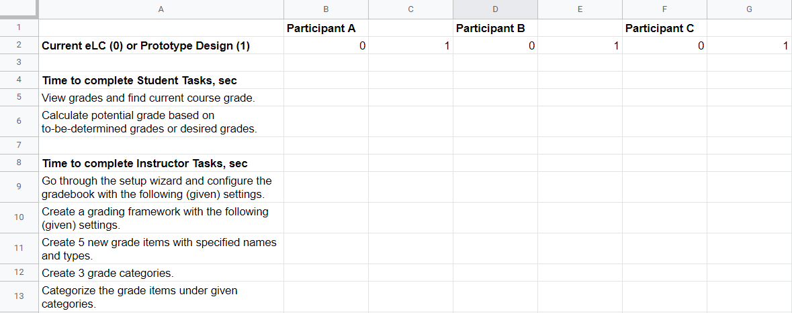
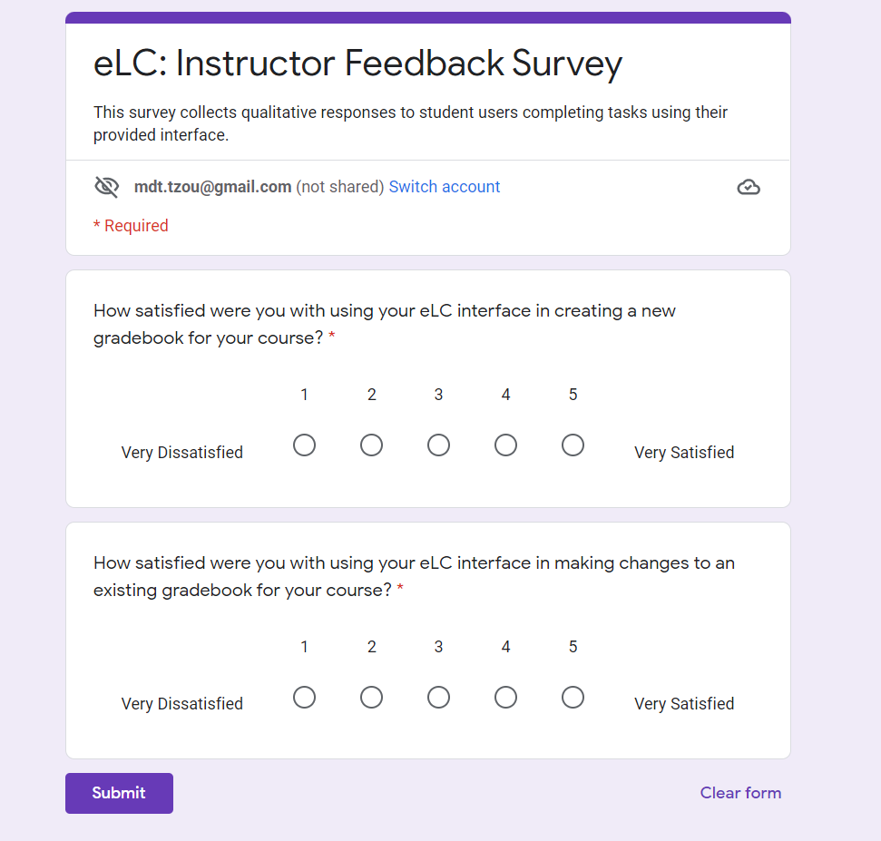
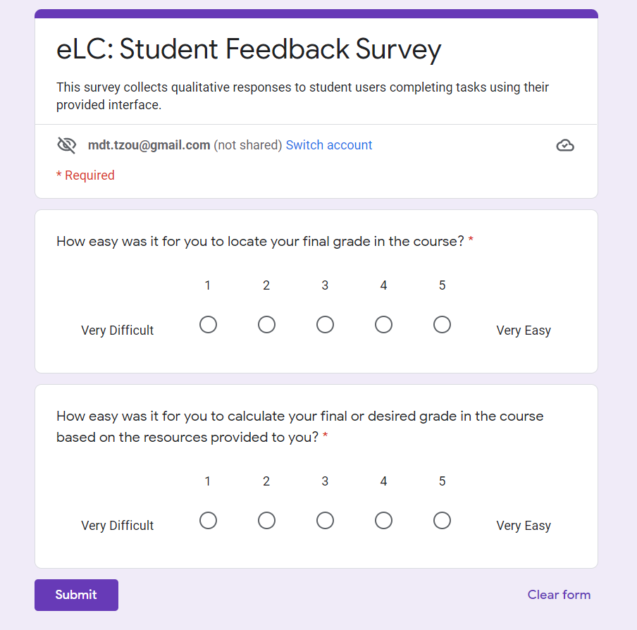

# Milestone 4: Prototyping & Testing
[Back to Home](https://matzomt.github.io/csci4800/)

# A. High-Fidelity Prototype

We prototyped interactions for both the student view of the eLC Grades page and the instructor view.

**Source Figma File**: [download](https://github.com/MatzoMT/csci4800/blob/gh-pages/assets/Prototypes.fig)

### Protoype Walkthrough




### Protoype Artboards




Asset Attributions:

Icons in eLC Header: © 2021 D2L Corporation, Brightspace LMS.

eLearning Commons Logo: © University of Georgia, Athens, GA 30602.

## User Stories
### User Story 1
Description:  As a student user, I want to view my overall calculated grade in a course so that I can understand my overall performance in the class.

For this user story, we implemented a few changes to the eLC Grades page from the student view. We adopted eLC’s current strategy to display an overall course grade at the top of the Grades table, with the major change being that this table would always be displayed by default. We added some additional color signifiers to highlight the overall grades (on a gradient of green for higher grades to yellow and red for lower grades, which may correspond to letter grades of A-F or percentage values from 100-0, depending on the configuration of the grading schema on the instructor end). This color signifier provides quick at-a-glance feedback of what the student’s performance in the class is. Most significantly, we added a grade calculator to the right hand side of the page. In this grade calculator pane, we included a breakdown of the instructor’s chosen categories and weights, allowing students to get a picture of how much each of their assignments counts for, without needing to cross reference the syllabus. Additionally, the calculator takes in the student’s currently calculated grade, and allows students to input a hypothetical future grade and the weight of the total class grade it would count for, in order to get an estimate of their potential future grade. This further assists students in understanding their overall and future class performance.



Demo Video: <https://youtu.be/MUNRKCxmh9M>

### User Story 2
Description: As an instructor user, I want to configure a gradebook with features important to students as well as to myself, so that my students are not confused regarding their grade view, I will have to spend less time answering their questions, and I can match my preferred grading style.

For this story, we felt as though eLC does not have the proper warning messages for an instructor to properly understand that they are not allowing students to view information about their final grades specifically. In order to do this, we created error popups which arise when the instructor unchecks a crucial grade viewing box. We ensured to make this red and clear so that if an instructor does choose to proceed with the action, they are aware what the student user will or will not see. We did this within the setup wizard throughout each of the seven steps of the setup as needed. We also made these important settings opt-out rather than opt-in, to take advantage of the default effect (the tendency of agents to accept the default option). Another design change which we implemented was incorporating better visuals. We liked how Blackboard uses green and blue signifiers throughout as their color scheme because it makes the gradebook much more aesthetically pleasing than a plain black and white page. Specific submit buttons are green as well as incorporating more blue for the other components of this setup wizard. This makes the gradebook setup less boring or overwhelming as the use of colors and font weights help to split up the information in a logical way. Another implementation we made was adding a shaded completion bar for the seven steps. We found that this design change makes the navigation through the seven steps more comprehensible and allows the instructor to feel like they know how far along they are in the process. 



Demo Video: <https://youtu.be/BUbFnncrHPY>

### User Story 3
Description: As an instructor user, I want some easy sample frameworks available to use so I can choose a functional and user-friendly set-up without having to know every intricacy of eLC.

This story concerned the present difficulty of setting up a gradebook for an instructor. We found that eLC does not provide an easy way for an instructor to manage all of their classes or to create a gradebook for their class. As an example, there are few signifiers or visuals in place to help aid an instructor in setting up their gradebook, and the gradebook setup is missing key features such as drag-and-drop functionality. There are also many nested features that are not immediately noticeable and navigable. The biggest design change we implemented for this milestone was to implement a new frameworks feature where instructors can set up a gradebook based on frameworks commonly used for certain situations, such as pass-fail, letter-grade, or online only instruction. Each framework is supplied with a tooltip that gives a quick overview of what the framework is and which frameworks are appropriate for which situations. A framework manager was also added that allows an instructor to compare all of their gradebook formats in current classes inside of a single pane instead of in different windows, and instructors also have the ability to duplicate or edit existing frameworks from the manager. Other changes to the gradebook setup include the use of different colors to signify grade items by their effect on the final grade and warnings pointing out possible mistakes in gradebook weights. We felt that these changes would minimize the amount of work needed for an instructor to be comfortable with configuring eLC by reducing the amount of hidden features and easing the task of setting up a gradebook.



Demo Video: <https://youtu.be/o5FCp7UxU1w>

### User Story 4
Description: As an instructor user, I want to be able to appropriately categorize a grade item so that I can match my syllabus weighting structure.
 
For this story, we noticed that the existing implementation in eLC to complete this task was rather cumbersome, requiring instructors to make several clicks through pages and menus in order to create multiple categories and then categorize a grade item. We implemented two major design changes to alleviate this frustration: first, we provided a page with a simple form where instructors could add categories in bulk, instead of needing to click through the whole menu page for each one. This form is accessible through a separate “New Category” button that brings the categorization functionality up front and center, rather than being hidden in a dropdown. Additionally, we transformed the static table on the manage grades page into a table with drag-and-drop functionality, in order to afford more easy categorization of grade items or ordering of categories/items. With these changes, we have made it easier for instructors to manage grade items and categories, ultimately helping it match their syllabus’s grading structure in a simpler way. These changes on the instructor end would end up positively impacting the student’s experience of their Grades page as well, because a Grades page with clearly defined categories is easier to interpret and calculate an overall grade for. For instance, if more instructors categorized their grade items, this would make it so that students would be less likely to need to cross reference the class syllabus when viewing their grades.



Demo Video: <https://youtu.be/8TawJRqLOWw>

### User Story 5
Description: As an instructor using the eLC gradebook, I want all of the important fields clearly marked when creating a grade item so that I do not forget anything and the process is smooth.

For this story, we noticed that the existing implementation in eLC to enter a new grade item was slow with many different pages as well as too many options immediately on one page. We understood from our research that instructors find the current methods of adding a new item too confusing and complex. We helped relieve these problems by distilling the initial landing page of creating a grade item to the essential parts as well as setting certain settings to common default settings. Instructors are still able to access every feature provided by the old implementation to adjust the grade item to their liking, but instructors less comfortable with the affordances still have clear and easy signifiers on how to create a simple grade item for their gradebook that contains all the necessary elements a student user would need to understand their grade. We achieved these goals by replacing the initial landing page of choosing which grade type it is to a dropdown menu. This reduces the amount of steps required to create a grade item as well as reducing the long page of text lacking signifiers to a dropdown menu that has the same affordances but with clearer signifiers on what is needed. We also improved usability by containing all the elements needed for a clear and concise grade item to the first page while still providing all the affordances through the click of an arrow opening up the advanced options. If the user attempts to submit invalid fields in areas that are pertinent to student understanding of the gradebook, the page will show a warning message with which elements are invalid as well as a red outline around the problematic sections. These changes on the instructor end would positively impact the student user’s experience because it will be less common for grade items on the grade page to be missing crucial information as well as making it easier to interpret their current grade and level of success in the class.



Demo Video: <https://youtu.be/XzXJlt1TGnk>

# B. Testing Protocol
**Research Questions**:
- Does adding a grade calculator and default calculated grade to the student view of eLC improve a students’ ability to determine their standing in a course?
- Does changing the eLC instructor view format from a text-based UI to a more colorful and graphics-heavy UI improve instructors’ ability to use eLC?
- Does adding user prompts, error messages, and features that are opt-in by default make instructor users more likely to enable student-friendly gradebook features?
- Does adding a course framework manager to the instructor view of eLC improve instructors’ satisfaction and speed when configuring their gradebook?
- Does a bulk-edit and drag-and-drop interface increase an instructor’s speed and likelihood to categorize grade items?

## Methodology
We believe that the most suitable methodology for testing our product would involve mixed methods. 

An experimental setup will allow us to get quantitative data to examine our research questions, many of which are centered around the time taken or ease of use of the new platforms. An experiment would involve recruiting from at least two different populations, students and instructors, to determine which prototype and view of eLC they will be given. Participants will be given the original eLC and a prototype of our product. We would observe the users as they perform certain tasks related to using the eLC gradebook and measure the time taken; for testing the instructor side, this would include setting up a grading structure and framework, and for the student side, this would include determining the student’s overall grade in a class. 

We also want to collect qualitative data on the user’s experiences and emotions while performing the tasks to address the more subjective aspect of our research question. Therefore, after the tasks, we would conduct a survey asking the participants qualitative questions such as whether they were able to complete a task successfully and whether they felt the task was easy to perform. By analyzing both the time taken to perform the above tasks and the percent of users who gave positive feedback among the two groups, we would then be able to determine the effects of our proposed redesign of the eLC grades page and compare the two designs. Surveys are well suited to this purpose because they are a low-cost, low-bias way to obtain precise results about subjetive questions. [1]

Our testing experiment aligns with Ronald Fisher’s principles for Designed Experiments [2] as follows:
1. Comparison: For our experiment, the treatment would be the changes done to eLC, including adding frameworks, visualizing the setup of a gradebook, and other UI changes, while the control would be the current state of eLC.
2. Randomization: The experiment will select participants randomly to minimize sources of bias.
3. Statistical replication: Each trial will be repeated and analyzed for a user to fully complete their given task. The time and success to complete each task will be analyzed with other trials based on the number of attempts already taken. The setup of our experiment is easily replicable by another study.
4. Blocking: We would wish to recruit our two experimental groups from actual college students and instructors that have used learning management systems before (not necessarily eLC). This ensures our participants are familiar with the needs and desires of typical users. Thus, we have two blocks from which we would draw our random sample, though each block would be for a separate study group.
5. Orthogonality: To reduce the interference between variables, certain parts of the experiment will be constant. These parts include running the experiment on the same wireless connection and hardware in the same testing environment.
6. Factorial design: We will not be employing a factorial design for our study as we do not wish to study the intersections of multiple independent variables.

## Testing Procedure 

**Informed Consent Plan**: Because our research involves experimentation with human subjects, our group will distribute an informed consent form to testing subjects prior to testing. Based on a sample informed consent structure provided by the Smithsonian Institution, the informed consent form will outline the purpose of the experiment, testing procedures, risks to testing subjects, subject confidentiality, and benefits of the experiment. We would also make sure that our informed consent form to UGA's human research program specifications as outlined in UGAHRP-090-3 online. [3]

**Data Collection**: Data we would need to collect regarding testing subjects would be their occupation and experience with learning management systems such as eLC. The testing subjects’ occupation (student or instructor) will determine which experiment the subject will be placed in. Our two primary experiment groups are for tasks designed for instructors and tasks designed for students. Experiment information gathered includes the time taken to complete a task and whether the testing subject was successful in completing their task.  An experimenter will record the data as the participants complete their tasks.

Tasks for each subject group are described as follows:

Instructor
- Go through the setup wizard and configure the gradebook with the following (given) settings.
- Create a grading framework with the following (given) settings.
- Create 5 new grade items with specified names and types.
- Create 3 grade categories.
- Categorize the grade items under given categories.

Student
- View grades and find current course grade.
- Calculate potential grade based on to-be-determined grades or desired grades.

Data collected by these experiments and on testing subject identities would be placed inside a spreadsheet such as Microsoft Excel or Google Sheets. Our proposed spreadsheet design for data collection is pictured below. Each participant will complete the tasks with the real eLC interface and with our prototype. We will randomly select which interface the participant will use first. This is to minimize the ordering effect, as we anticipate that whichever design is used second may have slightly faster times as participants will know what to expect. If a participant is not able to complete a task, an “x” will be marked in place of a time to completion.

To perform a qualitative analysis on student and instructor testing subjects’ ability and satisfaction in using our eLC design, we would ask a survey at the end of each participant is completed with their tasks for each type of interface (original vs prototype). A sample survey and its questions are as follows:

Students:
1. How easy was it for you to locate your final grade in the course? 
    - This question will be asked to all students, both the control and treatment groups, and responses will be given on a scale from 1 to 5, with 1 being very difficult and 5 being very easy.
2. How easy was it for you to calculate your final or desired grade in the course based on the resources provided to you? 
    - This question will be asked to all students, both the control and treatment groups, and responses will be given on a scale from 1 to 5, with 1 being very difficult and 5 being very easy.

Instructors:
1. How satisfied were you with using your eLC interface in creating a new gradebook for your course? This question will be asked to instructors across both the control and treatment groups, and responses will be given on a scale from 1 to 5, with 1 being very dissatisfied and 5 being very satisfied.
2. How satisfied were you with using your eLC interface in making changes to an existing gradebook for your course? This question will be asked to instructors across both the control and treatment groupos, and responses will be given on a scale from 1 to 5, with 1 being very dissatisfied and 5 being very satisfied.	

We chose these questions and basic format based on standard system usability questions, though adapted to our use case of specific tasks on the eLC grades page. Survey questions would likely be administered over a platform such as Google Forms. The results will then be put in a spreadsheet similar to what was used to store information for testing experiments, and the numerical values given in survey responses will be analyzed to see instructor’s qualitative reactions to using eLC.

For our quantitative data collected in the spreadsheet, we wish to analyze the difference between the mean times of the two groups: the current eLC design and the new proposed design. This would best be accomplished with a [paired samples t-test](https://en.wikipedia.org/wiki/Student%27s_t-test
) which compares the mean times of both the current design group and the prototype groups, to determine if there is a statistically significant difference between the two. A paired t-test is appropriate to use when analyzing our data because a single set of data points corresponds to the same subject on a certain task, one for the current design and one for the prototype design. [4]

This will help us answer the following research questions: 
- Does adding a course framework manager to the instructor view of eLC improve instructors’ (satisfaction and) speed when configuring their gradebook? 
    - By analyzing the tasks related to instructor speed when configuring a gradebook framework
- Does a bulk-edit and drag-and-drop interface increase an instructor’s speed and likelihood to categorize grade items? 
    - By analyzing the tasks related to time to add and categorize grade items 
- Does adding a grade calculator and default calculated grade to the student view of eLC improve a students’ ability to determine their standing in a course? 
    - By analyzing the tasks related to the speed at which students can determine and calculate their overall course grade

For each question, if a t-test reveals that there is a statistically significant difference in the times between the two groups on the corresponding task(s), we will be able to gain insight into our research question. For example, if the t-test performed on the values for the task "Categorize the grade items under given categories" shows a significant p-value, we will have reason to conclude that the redesigned interface using a drag-and-drop table improved the instructor's speed at the task of categorizing grade items.

For the survey data, measuring the user’s ability and ease of completing their task on a numerical scale, the numerical data in the responses would be collected into a spreadsheet like the quantitative data. From there, a simple data analysis can be performed to find a relation between the different eLC formats and user response. This analysis can be as simple as comparing the percentage of users reporting a positive, negative, or neutral response between the two types of inerfaces. This will allow us to potentially falsify the following research questions:
- Does adding a grade calculator and default calculated grade to the student view of eLC improve a students’ ability to determine their standing in a course?
    - If a larger percent of the student group indicate they are satisfied (postive emotions) after the prototype experience, then the features added may be helpful.
- Does changing the eLC instructor view format from a text-based UI to a more colorful and graphics-heavy UI improve instructors’ ability to use eLC?
    - If a larger percent of the instructor group indicate they are satisfied (postive emotions) after the prototype experience, then the colors and graphics may be helpful.
- Does adding a course framework manager to the instructor view of eLC improve instructors’ satisfaction (and speed) when configuring their gradebook?
    - If a larger percent of the instructor group indicate they are satisfied (postive emotions) after the prototype experience, then the framework feature may be an improvement.

**Pandemic Protocols**: Because our testing procedure relies on the time taken to perform a task, it is important for certain controls to be in place. These controls include users having access to the same computer to ensure even performance, and identical peripherals such as a mouse to ensure that users’ performance would not be interfered with using different hardware. Since a computer and its components are high-touch surfaces, our experiment would have COVID-19 protocols in place, such as mask wearing. All high-touch surfaces used in the experiment would also be disinfected before use by each testing subject.

# C. Final Summary Video



Demo Video: <https://youtu.be/715MK6Jgiho>

# Sources

[1] Ponto, Julie. Understanding and Evaluating Survey Research. 2015. Journal of the Advanced Practicioner in Oncology. From <https://www.ncbi.nlm.nih.gov/pmc/articles/PMC4601897/>

[2] Fisher, Ronald. The Design of Experiments. 1935.

[3] Human Research Protection Program. IRB Informed Consent Process for Research. University of Georgia. From <https://research.uga.edu/docs/policies/compliance/hso/IRB-Informed-Consent-Process-for-Research.pdf>

[4] 'Student's' t Test (For Paired Samples). Rice University. From <https://www.ruf.rice.edu/~bioslabs/tools/stats/pairedttest.html>